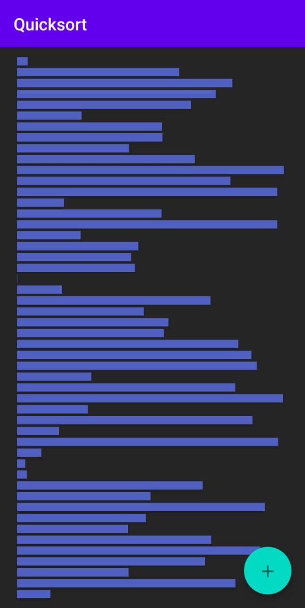
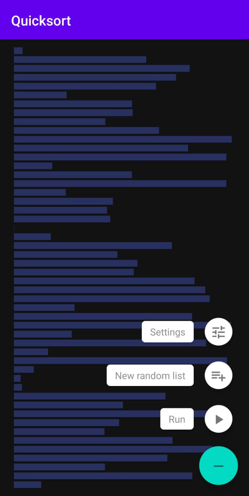
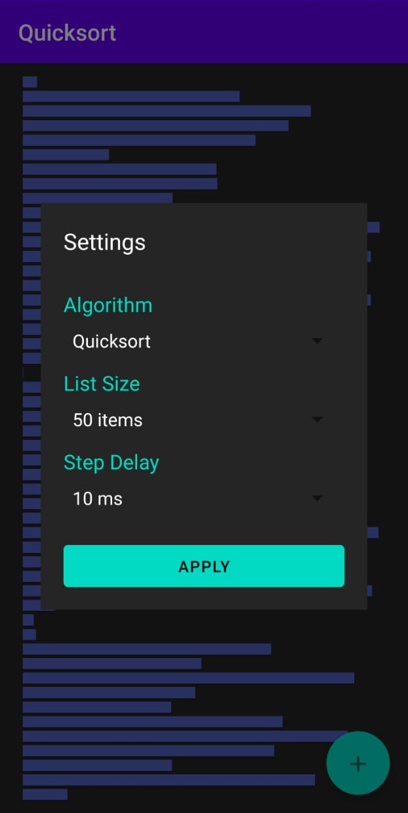
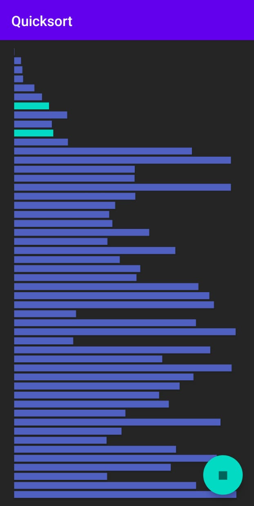
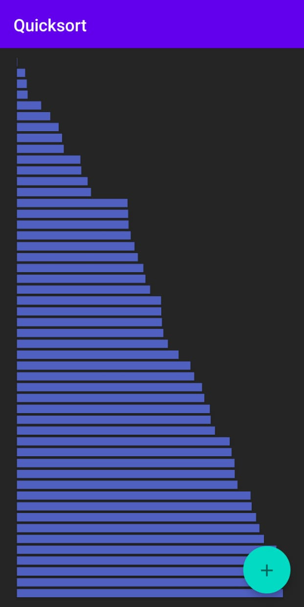
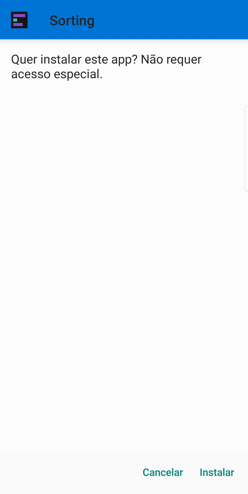
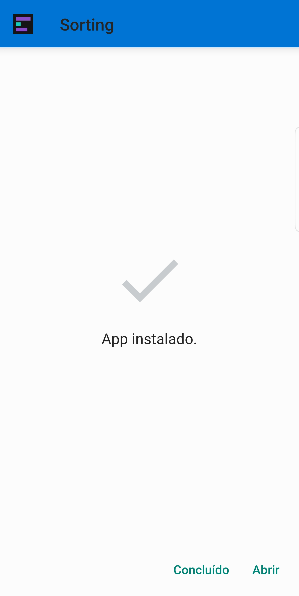

# Sorting

## Sobre
Com o Sorting, é possível visualizar passo a passo a execução dos algorítmos de HeapSort, Insertion Sort, MergeSort e QuickSort, permitindo ao usuário alterar
o tamanho da lista e o delay entre operações.

Abaixo, o fluxo de utilização:

  
  
  
  
  

Na primeira imagem, temos a vista inicial do aplicativo, com uma lista desordenada na vertical e um botão flutuante no canto inferior direito.
Ao clicar no botão flutuante, outros botões são apresentados. Com o primeiro, parâmetros podem ser configurados, pelo menu apresentado na terceira imagem.
Após configurar como desejar, ao pressionar 'Run', o algorítmo começa a ser executado, como mostrado na quarta imagem. As duas barras destacadas são as que
trocam de lugar no passo em questão. O processo pode ser pausado por meio do botão flutuante, ou finalizará quando a lista estiver ordenada. Ao fim, na quinta
imagem, temos a lista ordenada. Para recomeçar, basta abrir o menu principal e selecionar 'New random list', voltando ao estado da primeira imagem.

Este é um projeto desenvolvido com o objetivo de estudar algorítmos de ordenação, bem como o desenvolvimento de aplicativos híbridos.
O app foi construido utilizando o React Native, e os testes são realizados com o Jest. O processo de build é realizado pela plataforma Expo.

---

## Uso do app
Após instalar, basta abrir o aplicativo para iniciar seu uso. As interações são feitas através do botão flutuante no canto inferior direito.

### 'Settings'
Escolha o algorítmo de ordenação usado, o tamanho da lista e o delay, em milissegundos, entre cada passo.

### 'New random list'
Cria uma nova lista aleatória para ser ordenada.

### 'Run'
Executa a simulação com a lista atual e os parâmetros selecionados. Em cada passo, os elementos realizando troca de posição são destacados em verde,
enquanto os outros permanecem azuis. Durante a simulação, o botão flutuante se torna um botão de *'Pause'*, que interrompe a execução. Caso o pressione, pode-se dar
continuidade à execução clicando em *'Run'* novamente.

---

## Instalação do app para Android
### Pré-requisitos
* Dispositivo Android.
* Método de transferência de arquivos do computador para o dispositivo.

### Passo-a-passo
1. Na aba de [Releases](https://github.com/kaiquesacchi/Sorting/releases), baixar o arquivo APK e transferí-lo para o dispositivo.
2. No dispositivo, selecionar o arquivo e permitir a instalação.

  
  

3. Após a instalação, basta utilizá-lo como um app normal.

---

## Execução em ambiente de desenvolvimento
### Pré-requisitos
* Emulador de dispositivo móvel (Android ou iOS) ou dispositivo Android conectado via USB.
* Node.js na versão 13.13.0. Recomendado o uso do [nvm](https://github.com/nvm-sh/nvm) (Node Version Manager).

### Passo-a-passo
1. Clonar o repositório.
2. Abrir o emulador de dispositivo móvel.
3. Acessar a pasta-raíz do projeto.
4. Instalar as dependências com `npm install`.
5. Executar o projeto com `expo start`. Um [servidor local] (localhost:19002) será aberto.
6. Acessar o servidor pelo navegador e selecionar ***run on Android device/emulator*** ou ***run on iOS simulator***, na barra lateral.

---

## Gerar arquivo de instalação
### Pré-requisitos
* Conta do Expo já conectada no terminal.

### Passo-a-passo
1. Iniciar o processo de build com `expo build:<plataforma_desejada>`. Por exemplo, `expo build:android`.
2. Selecionar o formato de build desejado, como APK.
3. Aguardar o processo de inicialização do build. Um link será gerado para acompanhar o processo (no formato `https://expo.io/dashboard/<usuário_expo>/builds/<build_id>`).
4. No site, ao fim do processo, um botão de download estará disponível.
